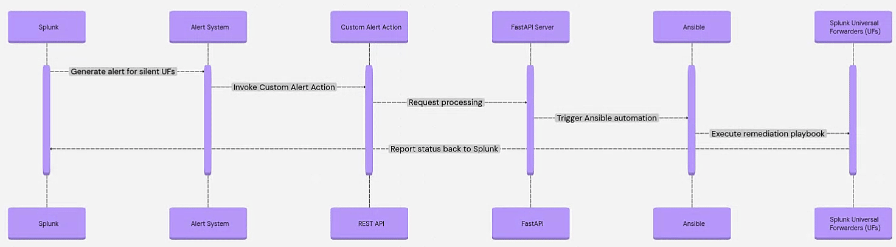

# Splunk UF Automated Restart System

## ⚠️ IMPORTANT DISCLAIMER

**This is a DEMO PROJECT and is NOT intended for production use.**

This project is designed for educational and demonstration purposes only. It showcases the integration of various technologies including Splunk, FastAPI, Ansible, and Terraform for automated UF management.

**Before using in any production environment, you MUST:**
- Review and modify all security configurations
- Implement proper authentication and authorization
- Add comprehensive error handling and monitoring
- Conduct thorough security testing
- Review and update all default passwords and credentials
- Implement proper backup and disaster recovery procedures
- Add comprehensive logging and audit trails
- Review compliance requirements for your organization

**The authors and contributors are NOT responsible for any issues, security vulnerabilities, or data loss that may occur from using this project in production environments.**

## Overview

This system provides automated detection and remediation of silent Splunk Universal Forwarders (UFs) through a sophisticated integration of Splunk alerts, REST APIs, custom alert actions, FastAPI, and Ansible automation.

## Demo



*Demonstration of the automated UF restart system in action*

## Project Structure

```
splunk-uf-automation/
├── ansible-playbooks/          # Ansible playbooks for UF restart
│   ├── restart_uf_linux.yml   # Linux UF restart playbook
│   └── restart_uf_windows.yml # Windows UF restart playbook
├── docker/                     # Docker configuration
│   ├── docker-compose.yml     # Docker Compose configuration
│   └── Dockerfile             # Multi-stage Docker build
├── fastapi-server/            # FastAPI application
│   ├── app/                   # Application code
│   │   ├── config.py         # Configuration management
│   │   ├── exceptions.py     # Custom exception classes
│   │   ├── file_logger.py    # Logging utilities
│   │   ├── logging_config.py # Enhanced logging configuration
│   │   ├── main.py           # FastAPI application entry point
│   │   ├── security.py       # Security utilities
│   │   └── utils.py          # Utility functions
│   └── requirements.txt       # Python dependencies
├── splunk-app/                # Splunk custom alert action
│   └── uf_restart_alert/     # Custom alert action app
│       ├── appserver/        # Web UI components
│       │   └── static/       # Static assets
│       ├── bin/              # Python scripts
│       │   └── uf_restart.py # Enhanced alert action script
│       ├── default/          # Configuration files
│       │   ├── alert_actions.conf # Alert action configuration
│       │   ├── app.conf      # App configuration
│       │   └── data/ui/alerts/uf_restart.html # Alert UI
│       └── metadata/         # App metadata
├── terraform/                 # Infrastructure as Code
│   ├── main.tf               # Main Terraform configuration
│   ├── variables.tf          # Variable definitions
│   ├── outputs.tf            # Output definitions
│   ├── terraform.tfvars      # Variable values
│   ├── deploy.sh             # Deployment script
│   └── user-data/            # EC2 user data scripts
│       ├── fastapi-server.sh # FastAPI server setup
│       ├── splunk-enterprise.sh # Splunk Enterprise setup
│       └── splunk-uf.sh      # Splunk UF setup
├── Splunk-Ansible-AutoResponse.gif # Demo animation
└── README.md                  # This documentation
```

## Architecture Overview

```
┌─────────────────┐     ┌──────────────────┐     ┌─────────────────┐
│   Splunk UF     │────▶│  Splunk Server   │────▶│  Deployment     │
│   (Agents)      │     │  (Monitoring)    │     │    Server       │
└─────────────────┘     └──────────────────┘     └─────────────────┘
                               │                          │
                               ▼                          │
                        ┌──────────────┐                 │
                        │    Alert     │                 │
                        │   Triggered  │◀────────────────┘
                        └──────────────┘         (REST API)
                               │
                               ▼
                    ┌──────────────────┐
                    │  Custom Alert    │
                    │     Action       │
                    └──────────────────┘
                               │
                               ▼
                    ┌──────────────────┐
                    │   FastAPI        │
                    │    Server        │
                    └──────────────────┘
                               │
                               ▼
                    ┌──────────────────┐
                    │    Ansible       │
                    │   Playbooks      │
                    └──────────────────┘
```

## Key Features

- 🔍 **Automatic Detection**: Monitors UF heartbeat logs to detect silent agents
- 📊 **Alert Enrichment**: Adds IP and OS information via Deployment Server REST API
- 🎯 **Custom Alert Actions**: Configurable Splunk alert action with enhanced retry logic
- 🚀 **FastAPI Integration**: RESTful API with rate limiting, security, and comprehensive logging
- 🔧 **Cross-Platform Automation**: OS-specific Ansible playbooks for UF restart
- 🐳 **Containerized Deployment**: Docker packaging with volume-mounted playbooks
- 📈 **Enhanced Monitoring**: Comprehensive logging, health checks, and system statistics
- 🔄 **Asynchronous Processing**: Non-blocking task execution with status tracking
- 🛡️ **Security Features**: Input validation, rate limiting, and secure authentication
- 🏗️ **Infrastructure as Code**: Complete Terraform deployment with AWS EC2 instances
- 📋 **Task Management**: Full task lifecycle tracking with retry mechanisms
- 🔧 **Error Handling**: Comprehensive exception handling and circuit breaker patterns

## Components

### 1. Splunk Alert Configuration
- **Purpose**: Detects silent UFs and enriches with deployment server data
- **Trigger**: Runs every 5 minutes, alerts when UFs haven't reported for 15+ minutes
- **Configuration**: Built into the Splunk Enterprise setup script

### 2. Custom Splunk Alert Action
- **Files**: `splunk-app/uf_restart_alert/`
- **Purpose**: Sends alert data to FastAPI server with configurable UI
- **Features**: Enhanced retry logic, correlation ID tracking, comprehensive error handling
- **Script**: `uf_restart.py` with exponential backoff and validation

### 3. FastAPI Server
- **Files**: `fastapi-server/`
- **Purpose**: Receives alerts and orchestrates Ansible playbook execution
- **Features**: Rate limiting, security validation, comprehensive logging, task management
- **Endpoints**:
  - `POST /restart-uf`: Trigger UF restart
  - `GET /tasks`: List all tasks with filtering
  - `GET /tasks/{task_id}`: Get specific task status
  - `DELETE /tasks/{task_id}`: Delete task from logs
  - `GET /health`: Health check with system statistics

### 4. Ansible Playbooks
- **Files**: `ansible-playbooks/`
- **Purpose**: OS-specific UF restart procedures
- **Supported OS**: Linux (systemd), Windows (services)
- **Features**: Dynamic inventory creation, comprehensive logging

### 5. Docker Configuration
- **Files**: `docker/`
- **Purpose**: Containerized deployment with FastAPI and Ansible
- **Features**: Multi-stage build, volume mounts, health checks, network isolation

### 6. Terraform Infrastructure
- **Files**: `terraform/`
- **Purpose**: Complete AWS infrastructure deployment
- **Components**: VPC, EC2 instances, security groups, IAM roles
- **Features**: Spot instances, encrypted storage, automated user data scripts

## Deployment Options

### Option 1: Terraform AWS Deployment (Recommended for Demo)

The project includes complete Terraform infrastructure code for AWS deployment:

```bash
# Navigate to terraform directory
cd terraform/

# Initialize Terraform
terraform init

# Review the plan
terraform plan

# Deploy infrastructure
terraform apply

# Or use the deployment script
./deploy.sh
```

**Infrastructure Components:**
- VPC with public subnet
- 3 EC2 instances (FastAPI, Splunk Enterprise, Splunk UF)
- Security groups with appropriate port access
- IAM roles and policies
- Encrypted EBS volumes
- Spot instances for cost optimization

### Option 2: Manual Server Deployment

This system requires three separate servers for optimal performance and security:

#### 1. FastAPI Server (2 vCPU, 2GB RAM)
- **Purpose**: Hosts the FastAPI application and Ansible automation
- **OS**: Ubuntu 24.04 (recommended)
- **Requirements**: Docker and Docker Compose installed
- **Network**: Access to Splunk Enterprise server and UF hosts

#### 2. Splunk UF Server (1 vCPU, 1GB RAM)
- **Purpose**: Hosts Splunk Universal Forwarder for testing and monitoring
- **OS**: Ubuntu 24.04 (recommended)
- **Requirements**: Splunk Universal Forwarder installed
- **Network**: Access to Splunk Enterprise server

#### 3. Splunk Enterprise Server (4 vCPU, 4GB RAM)
- **Purpose**: Main Splunk server with alerting and deployment server
- **OS**: Ubuntu 24.04 (recommended)
- **Requirements**: Splunk Enterprise with Deployment Server
- **Network**: Access to all UF hosts and FastAPI server

## Server Setup Instructions

### Terraform Deployment (Recommended)

For automated deployment using Terraform:

1. **Prerequisites:**
   - AWS CLI configured with appropriate credentials
   - Terraform installed (version >= 1.0)
   - SSH key pair for EC2 access

2. **Deploy Infrastructure:**
   ```bash
   cd terraform/
   terraform init
   terraform plan
   terraform apply
   ```

3. **Access Instances:**
   - FastAPI Server: `http://<fastapi-public-ip>:7000`
   - Splunk Enterprise: `http://<splunk-public-ip>:8000`
   - Splunk UF: SSH access for testing

### Manual Server Setup

**Note**: The Terraform deployment automatically handles all server setup using user-data scripts. The manual setup below is provided for reference only.

#### FastAPI Server Setup

The FastAPI server setup script (`fastapi-server.sh`) automatically:

1. **System Updates**: Updates package index and installs required packages
2. **Docker Installation**: Installs Docker CE, Docker CLI, containerd, and Docker Compose
3. **User Management**: Creates `ansible` user with UID/GID 1204 for container compatibility
4. **SSH Configuration**: Enables password authentication for ansible user
5. **Repository Setup**: Clones the project and removes unnecessary folders
6. **Directory Creation**: Creates required directories for logs and inventory
7. **Container Deployment**: Builds and starts the FastAPI container

**Key Features:**
- Uses password authentication (`ansible123`) instead of SSH keys
- Automatically handles user UID/GID conflicts
- Cleans up unnecessary project folders
- Sets up proper directory permissions

#### Splunk UF Server Setup

The Splunk UF server setup script (`splunk-uf.sh`) automatically:

1. **User Creation**: Creates `splunkfwd` and `ansible` users with proper groups
2. **SSH Configuration**: Enables password authentication
3. **Sudoers Configuration**: Sets up passwordless sudo for Splunk UF service management
4. **Splunk UF Installation**: Downloads and installs Splunk Universal Forwarder 10.0.0
5. **Service Configuration**: Enables boot-start with systemd
6. **Deployment Server**: Configures connection to Splunk Enterprise server (10.20.30.101:8089)
7. **Output Configuration**: Sets up TCP output to Splunk Enterprise (10.20.30.101:9997)

**Key Features:**
- Automatic Splunk UF download and installation
- Pre-configured deployment server connection to Splunk Enterprise
- Proper service management permissions for ansible user
- TCP output configuration for data forwarding
- Uses password authentication (`ansible123`) instead of SSH keys

#### Splunk Enterprise Server Setup

The Splunk Enterprise server setup script (`splunk-enterprise.sh`) automatically:

1. **User Creation**: Creates `splunk` and `ansible` users with proper groups
2. **SSH Configuration**: Enables password authentication
3. **Sudoers Configuration**: Sets up passwordless sudo for Splunk service management
4. **Splunk Enterprise Installation**: Downloads and installs Splunk Enterprise 10.0.0
5. **Admin User Setup**: Creates admin user with password via user-seed.conf
6. **Service Configuration**: Enables boot-start with systemd
7. **Deployment Server**: Enables deployment server functionality
8. **Data Receiving**: Configures TCP input on port 9997
9. **Custom App Installation**: Installs the UF restart alert action app
10. **Automated Alert Configuration**: Creates both lookup and detection alerts

**Key Features:**
- Automatic Splunk Enterprise download and installation
- Pre-configured admin user with password (`12345678`)
- Automatic deployment server enablement
- Pre-configured TCP input for data receiving
- Automatic custom alert action app installation
- Pre-configured saved searches for UF detection

**Automated Alert Configuration:**

The script automatically creates two saved searches:

1. **UF_IP_OS_HOSTNAME**: Creates lookup table with UF information
   ```spl
   | rest /services/deployment/server/clients splunk_server=local
   | table hostname ip utsname
   | rename hostname as host, utsname AS os_name
   | outputlookup create_context=system uf_ip_os.csv
   ```

2. **UF_Silent_Detection**: Detects silent UFs and triggers restart action
   ```spl
   | tstats latest(_time) as last_seen WHERE index=_internal BY host
   | eval minutes_ago=round((now()-last_seen)/60,0)
   | eval last_seen_readable=strftime(last_seen, "%Y-%m-%d %H:%M:%S")
   | table host minutes_ago last_seen_readable
   | join type=left host [ | inputlookup uf_ip_os.csv | table host ip os_name ]
   | eval os_type=case(
       match(os_name, "(?i)windows"), "windows",
       match(os_name, "(?i)linux"), "linux",
       match(os_name, "(?i)darwin|mac"), "macos",
       1=1, "unknown")
   | eval alert_time=strftime(now(), "%Y-%m-%d %H:%M:%S")
   | table host ip os_type minutes_ago last_seen_readable alert_time
   | where minutes_ago > 2
   ```

**Alert Configuration:**
- **Schedule**: Every 2 minutes
- **Alert Condition**: Number of results > 0
- **Action**: Custom UF Restart Alert Action
- **FastAPI Endpoint**: Pre-configured to point to FastAPI server (10.20.30.10:7000)


Execute the following SPL search in Splunk to create a lookup file with UF host information:

```spl
| rest /services/deployment/server/clients splunk_server=local
| table hostname ip utsname
| rename hostname as host, utsname AS os_name
| outputlookup create_context=system uf_ip_os.csv
```

**What this does:**
- Queries the deployment server REST API to get client information
- Extracts hostname, IP address, and OS information
- Renames fields for consistency
- Creates a system lookup file that can be used in alerts

##### 4. Configure Alert Search

Create a new alert in Splunk using this search query:

```spl
| tstats latest(_time) as last_seen
    WHERE index=_internal
    BY host
| eval minutes_ago=round((now()-last_seen)/60,0)
| eval last_seen_readable=strftime(last_seen, "%Y-%m-%d %H:%M:%S")
| table host minutes_ago last_seen_readable
| join type=left host
    [ | inputlookup uf_ip_os.csv | table host ip os_name ]
| eval os_type=case(
    match(os_name, "(?i)windows"), "windows",
    match(os_name, "(?i)linux"), "linux",
    match(os_name, "(?i)darwin|mac"), "macos",
    1=1, "unknown"
)
| eval alert_time=strftime(now(), "%Y-%m-%d %H:%M:%S")
| table host ip os_type minutes_ago last_seen_readable alert_time
| search minutes_ago > 2
```

**What this search does:**
- Uses `tstats` to find the latest activity from each host in the `_internal` index
- Calculates how many minutes ago each host was last seen
- Joins with the UF context lookup to get IP and OS information
- Determines OS type based on the OS name
- Filters for hosts that haven't been seen for more than 2 minutes
- Formats the output for the alert action

**Alert Configuration:**
- **Schedule**: Every 5 minutes
- **Alert Condition**: Number of results > 0
- **Throttle**: 30 minutes by host field
- **Action**: Custom UF Restart Alert Action

## Enhanced Features

### Security Enhancements
- **Input Validation**: Comprehensive validation of all input data
- **Rate Limiting**: Built-in rate limiting to prevent abuse
- **Authentication**: Secure authentication mechanisms
- **Correlation IDs**: Full request tracing with correlation IDs
- **Audit Logging**: Comprehensive audit trails for all operations

### Monitoring and Observability
- **Health Checks**: Detailed health check endpoints with system statistics
- **Task Management**: Full task lifecycle tracking with status updates
- **Performance Metrics**: Request duration and performance monitoring
- **Error Handling**: Comprehensive exception handling with circuit breaker patterns
- **Logging**: Structured logging with multiple log levels and specialized loggers

### Infrastructure as Code
- **Terraform**: Complete infrastructure automation
- **Spot Instances**: Cost optimization with AWS spot instances
- **Encrypted Storage**: EBS volumes with encryption at rest
- **Security Groups**: Proper network isolation and access controls
- **IAM Roles**: Least privilege access with proper IAM policies

## Additional Deployment Considerations

### Network Requirements

#### Port Requirements
- **FastAPI Server**: 7000 (HTTP API)
- **Splunk Enterprise**: 8089 (Management), 8000 (Web UI), 9997 (Receiving)
- **Splunk UF**: 8089 (Deployment Server communication)
- **SSH**: 22 (for Ansible automation)
- **WinRM**: 5985/5986 (for Windows UF automation)

#### Firewall Configuration
```bash
# On FastAPI Server
sudo ufw allow 7000/tcp
sudo ufw allow 22/tcp

# On Splunk Enterprise Server
sudo ufw allow 8000/tcp
sudo ufw allow 8089/tcp
sudo ufw allow 9997/tcp

# On Splunk UF Server
sudo ufw allow 22/tcp
sudo ufw allow 8089/tcp
```

### Security Considerations

#### SSH Key Management
```bash
# Generate SSH key pair on FastAPI server
ssh-keygen -t rsa -b 4096 -f ~/.ssh/splunk_uf_automation

# Copy public key to all UF hosts
ssh-copy-id -i ~/.ssh/splunk_uf_automation.pub ansible@uf-host

# Test SSH connectivity
ssh -i ~/.ssh/splunk_uf_automation ansible@uf-host "echo 'SSH connection successful'"
```

#### SSL/TLS Configuration
For production deployments, configure SSL/TLS for the FastAPI server:

```bash
# Generate self-signed certificate (for testing)
openssl req -x509 -newkey rsa:4096 -keyout key.pem -out cert.pem -days 365 -nodes

# Update docker compose.yml to use SSL
# Add volumes for SSL certificates and update environment variables
```

### Monitoring and Maintenance

#### Health Check Script
Create a monitoring script to check system health:

```bash
#!/bin/bash
# health_check.sh

# Check FastAPI server
curl -f http://fastapi-server:7000/health || echo "FastAPI server is down"

# Check Splunk Enterprise
curl -f http://splunk-enterprise:8000/en-US/account/login || echo "Splunk Enterprise is down"

# Check UF status
ssh ansible@uf-host "sudo systemctl is-active SplunkForwarder" || echo "UF service is down"
```

#### Log Rotation
Configure log rotation to prevent disk space issues:

```bash
# Create logrotate configuration
sudo tee /etc/logrotate.d/splunk-uf-automation << EOF
/var/log/splunk-uf-automation/*.log {
    daily
    missingok
    rotate 30
    compress
    delaycompress
    notifempty
    create 644 splunk splunk
}
EOF
```

### Troubleshooting Common Issues

#### 1. Docker Container Won't Start
```bash
# Check container logs
docker compose logs uf-restart-api

# Check system resources
docker system df
docker system prune  # Clean up unused resources

# Restart container
docker compose restart uf-restart-api
```

#### 2. Ansible Connection Issues
```bash
# Test SSH connectivity
ansible all -i inventory.yml -m ping

# Check SSH key permissions
chmod 600 ~/.ssh/splunk_uf_automation

# Test specific host
ansible-playbook -i inventory.yml --check -l target-host restart_uf_linux.yml
```

#### 3. Splunk UF Not Starting
```bash
# Check Splunk UF logs
sudo tail -f /opt/splunkforwarder/var/log/splunk/splunkd.log

# Check service status
sudo systemctl status SplunkForwarder

# Restart service
sudo systemctl restart SplunkForwarder
```

#### 4. Alert Action Not Triggering
```bash
# Check Splunk alert logs
sudo tail -f /opt/splunk/var/log/splunk/splunkd.log | grep uf_restart_alert

# Test alert action manually
curl -X POST http://fastapi-server:7000/restart-uf \
  -H "Content-Type: application/json" \
  -d '{"host": "test-host", "ip": "192.168.1.100", "os_type": "linux"}'
```

### Performance Optimization

#### Resource Monitoring
```bash
# Monitor system resources
htop
iostat -x 1
ss -tulpn | grep :7000

# Monitor Docker resources
docker stats
```

#### Configuration Backup
```bash
# Backup Splunk configurations
sudo tar -czf splunk-config-backup-$(date +%Y%m%d).tar.gz /opt/splunk/etc/

# Backup FastAPI configurations
tar -czf fastapi-config-backup-$(date +%Y%m%d).tar.gz docker/ fastapi-server/
```

## Contributing

1. Fork the repository
2. Create a feature branch
3. Make your changes
4. Add tests for new functionality
5. Submit a pull request

## License

This project is licensed under the MIT License - see the LICENSE file for details.

## Support

For issues and questions:
1. Check the troubleshooting section
2. Review logs for error messages
3. Test with the provided test script
4. Open an issue with detailed information
